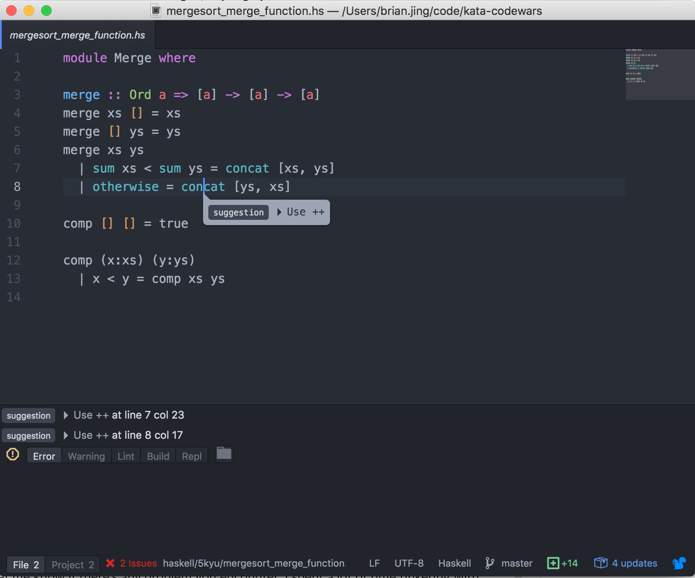
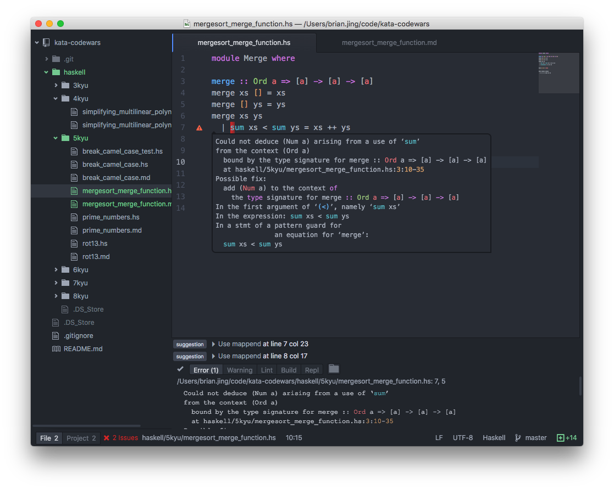

# Haskell

# Outdated. REQUIRE UPDATING

## Atom packages
```
apm install language-haskell haskell-ghc-mod linter-hlint autocomplete-haskell ide-haskell
```

## Atom configuration
All the executables installed by `stack` sit under ${HOME}/.local/bin/. For Atom to recognise them, either add the directory to your `PATH` environment variable or individually configure each Atom package.

# Screenshots
Real time suggestion


Linter error message in editor


