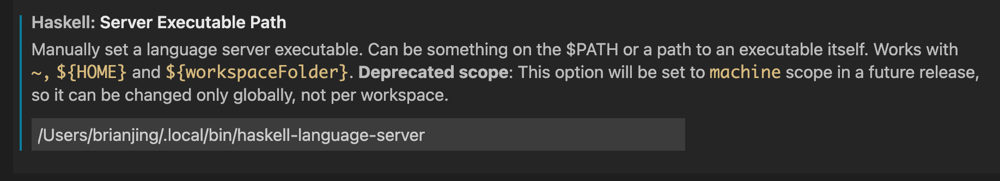

## VS Code Extensions
Install the following extensions within VS Code.
* [Haskell]
* [stylish-haskell]
* [hoogle-vscode]

Read on for details and usage info.

### The Haskell Extension
The [Haskell] extension is the most important extension out of the bunch, it supports the following
* syntax highlighting
* auto complete
* jump to definition (Alt + left click)
* type info on hover
* function documentation on hover
* code suggestion

If the [Haskell] extension doesn't work, here's a few things you can try:
* Install Haskell Language Server by hand:
  * By using ghcup
    ```
    ghcup install hls

    # or for a specific version
    ghcup install hls <version>
    ```
  * By installing manually from source
    * clone `https://github.com/haskell/haskell-language-server`
    * Run:
      ```
      stack ./install.hs hls

      # or for a specific version:
      stack ./install.hs hls-<version>
      ```
* From inside VSCode, manually specify path to `haskell-language-server` executable, it's either `~/.ghcup/bin/haskell-language-server-<version>` or `~/.local/bin/haskell-language-server`.


### Stylish Haskell
stylish-haskell is a decent Haskell code formatter.

The extension requires the actual tool be installed:
```
stack build --copy-compiler-tool stylish-haskell
```

In Settings, make sure:
* `Formatter Provider` is set,
* VSCode formats on
  * file save, and
  * on import

Saving file or pasting imports will auto-format.

Default shortcut is `Alt + Shift + f`, or type `format document` in command palette.

### Hoogle
This extension allows you to search hoogle within VS Code.

Default shortcut is `Alt + Shift + h`, or type `hoogle search` in command palette.

## Hasklig
This makes your operators pretty.

Download [Hasklig](https://github.com/i-tu/Hasklig).

Install the fonts in OSX's Font Book

Add the following confiugration in VS Code.
```
"[haskell]": {
  "editor.fontFamily": "Hasklig",
  "editor.fontLigatures": true
}
```

[Haskell]: https://marketplace.visualstudio.com/items?itemName=haskell.haskell
[hoogle-vscode]: https://marketplace.visualstudio.com/items?itemName=jcanero.hoogle-vscode
[stylish-haskell]: https://marketplace.visualstudio.com/items?itemName=vigoo.stylish-haskell
